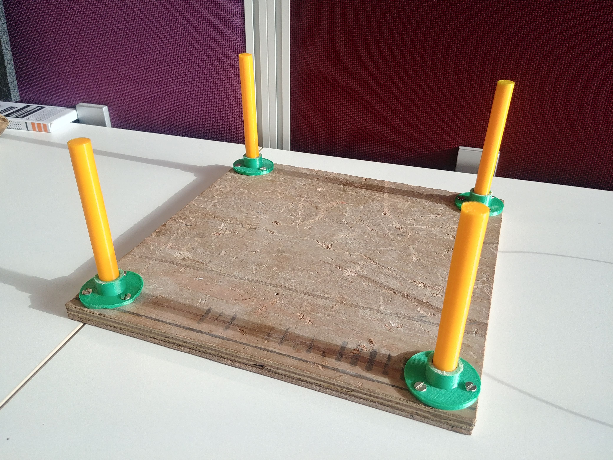
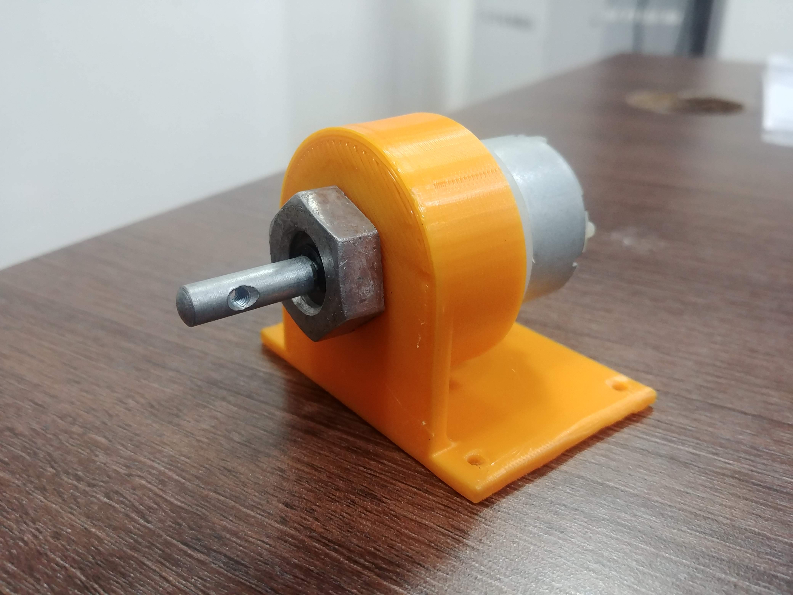

# ALFA : APTRI Labs Floor Assistant

## An internship project done at Adani Power

### Things required

- Raspberry Pi 3B+ (main controller)
- Pi cam (for camera feed)
- Power bank 10000 mAh (to power raspi)
- 4 x Motors (we have used 300RPM)
- L298N
- Lipo battery 4200 mAh
- Jumper Wires


### Robot structure
We started by designing a basic chassis on Solidworks 2017. Once the chassis design was finalised, we used the software ANSYS Student 19.2 to do structural analysis of the robot. This analysis helped us in identifying the major stress points and optimizing them by making necessary changes to the robot. The major components of the chassis were identified as follows:
1. Base plates
2. Support Rod Mounts

3. Support Rods

4. Motor Mounts


We used wooden based plates to aid in mounting the other components whereas the support rods mounts, support rods and motor mounts were all 3D Printed. The CAD files are available [here](/CAD%20files)


### Installation

1.> Installing WiringPi library. WiringPi is a GPIO access library written in C for the Raspberry Pi.
```
git clone git://git.drogon.net/wiringPi
cd wiringPi
./build
```


