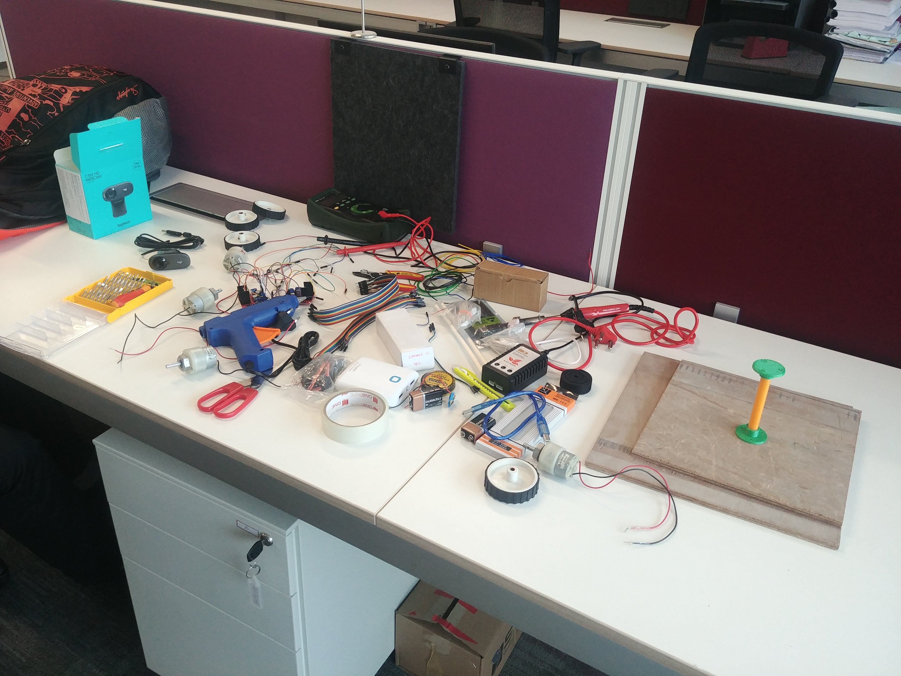
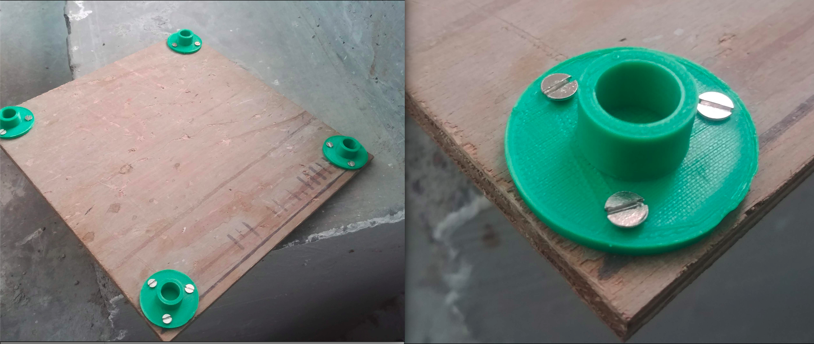
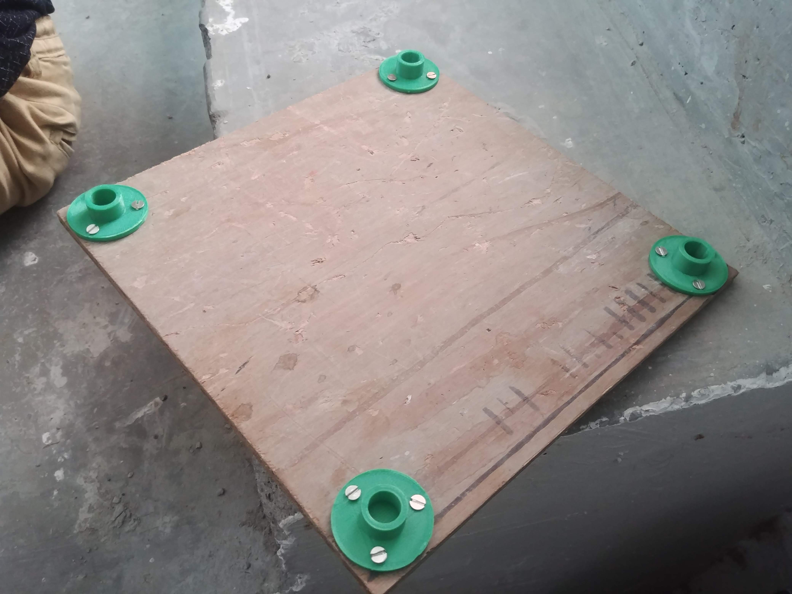

# ALFA : APTRI Labs Floor Assistant

## An internship project done at Adani Power

Creators : [Yug Ajmera](https://github.com/YugAjmera), [Maulik Ravani](https://github.com/Maulik1308), [Devansh Dhrafani](https://github.com/devanshdhrafani), [Dhairya Bohrania](https://github.com/Db1998).

### Things required
- Raspberry Pi 3B+ (main controller)
- Pi cam (for camera feed)
- Power bank 10000 mAh (to power raspi)
- 4 x Motors (we have used 300RPM)
- L298N
- Lipo battery 4200 mAh
- Jumper Wires
- Breadboard




### Robot structure
A basic chassis was designed on Solidworks 2017. Once the chassis design was finalised, the ANSYS Student 19.2 software was used to do the structural analysis of the robot. This analysis helped in identifying the major stress points and these were optimized them by making necessary changes to the robot. (insert ansys gif !)

The major components of the chassis were identified as follows:
1. Base plates (25cm x 25cm) - 2
2. Support Rod Mounts - 8
3. Support Rods - 4
4. Motor Mounts - 4


Wooden based plates were used to aid in mounting the other components whereas the support rods mounts, support rods and motor mounts were all 3D Printed. The CAD files are available [here](/CAD%20files)




### Assembly
The mounts were fixed to the base plates using screws.


### Connections
IN1 - 

### Installation
1. Load the Raspbian OS into your Raspberry Pi.

2. Installing WiringPi library. WiringPi is a GPIO access library written in C for the Raspberry Pi.
```
git clone git://git.drogon.net/wiringPi
cd wiringPi
./build
```

3. Installing Lighttpd server for hosting the webpage.
```
sudo apt-get -y install lighttpd

sudo lighttpd-enable-mod cgi

sudo lighttpd-enable-mod fastcgi
```
`sudo nano /etc/lighttpd/lighttpd.conf`

change:

server.document-root =“/var/www/html”

by:

server.document-root =“/var/www”

4. Installing raspicam library.
```
sudo apt-get install libjpeg62-turbo-dev 
sudo apt-get install cmake
git clone https://github.com/jacksonliam/mjpg-streamer.git ~/mjpg-streamer
cd ~/mjpg-streamer/mjpg-streamer-experimental
make clean all
sudo rm -rf /opt/mjpg-streamer
sudo mv ~/mjpg-streamer/mjpg-streamer-experimental /opt/mjpg-streamer
sudo rm -rf ~/mjpg-streamer
```

4. 
```
sudo mkdir /var/www
```
Copy the contents of the **code** folder and paste it in the /var/www folder.

5. 
```
sudo nano /etc/rc.local
```
Copy and paste the following just before "exit 0" line.
```
gpio -g mode 20 out

gpio -g mode 21 out

gpio -g mode 5 out

gpio -g mode 6 out

gpio -g mode 13 out

gpio -g mode 19 out

LD_LIBRARY_PATH=/opt/mjpg-streamer/ /opt/mjpg-streamer/mjpg_streamer -i "input_raspicam.so -fps 15 -q 50 -x 640 -y 480" -o "output_http.so -p 9000 -w /opt/mjpg-streamer/www" &
```

6. Restart the server after some changes.
```
sudo /etc/init.d/lighttpd stop
sudo /etc/init.d/lighttpd start
```

7. 
```
hostname -I
```
This will give you a IP address. You can access the web page using any wifi-enalbed device by entering this IP address. Using this, you can control the robot and also view the live video feed !


