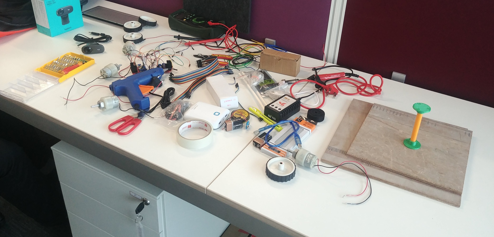
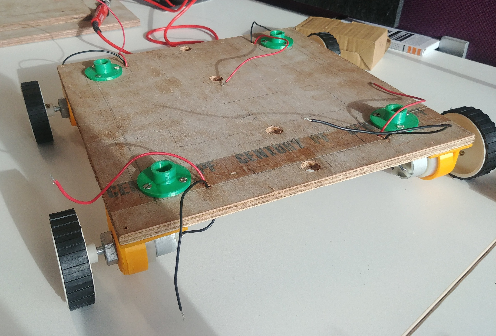

# ALFA : APTRI Labs Floor Assistant

## An internship project done at Adani Power

Creators : , , , 

### Things required
- Raspberry Pi 3B+ (main controller)
- Pi cam (for camera feed)
- Power bank 10000 mAh (to power raspi)
- 4 x Motors (we have used 300RPM)
- L298N
- Lipo battery 4200 mAh
- Jumper Wires
- Breadboard




### Robot structure
A basic chassis was designed on Solidworks 2017. Once the chassis design was finalised, the ANSYS Student 19.2 software was used to do the structural analysis of the robot. This analysis helped in identifying the major stress points and these were optimized them by making necessary changes to the robot. (insert ansys gif !)

The major components of the chassis were identified as follows:
1. Base plates (25cm x 25cm) - 2
2. Support Rod Mounts - 8
3. Support Rods - 4
4. Motor Mounts - 4


Wooden based plates were used to aid in mounting the other components whereas the support rods mounts, support rods and motor mounts were all 3D Printed. The CAD files are available [here](/CAD%20files)


### Assembly
The mounts were fixed to the base plates using screws.


### Connections


### Installation
1.> Installing WiringPi library. WiringPi is a GPIO access library written in C for the Raspberry Pi.
```
git clone git://git.drogon.net/wiringPi
cd wiringPi
./build
```


